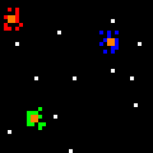

# Ant Simulation

This project simulates a system of ants that search for sugar and transport it to a nest by following sugar and nest pheromones. Each cell of the grid can be empty, contain an ant, sugar, or a nest element.

Ant Behavior

Ants move randomly in search of sugar. When they find sugar pheromones, they move along the pheromone trail while avoiding other ants until they reach the sugar. They carry some of the sugar while leaving sugar pheromones along their path. Once they are next to the nest, they deposit the sugar and leave sugar pheromones on the path back to the sugar pile.

# Ant Movement Rules

The ant movement rules are as follows, in descending order of priority:

- If the ant is searching for sugar and the adjacent cell contains sugar, then the ant picks up the sugar and leaves sugar pheromones on its cell.

- If the ant is returning to the nest and the adjacent cell contains a nest element, then the ant deposits the sugar.

- If the ant is returning to the nest and the adjacent cell is empty, closer to the nest than the current cell, and on a sugar pheromone trail, then the ant moves to that cell and leaves sugar pheromones on the cell.

- If the ant is searching for sugar and is on a sugar pheromone trail, the adjacent cell is empty, farther from the nest than the current cell, and on a sugar pheromone trail, then the ant moves to that cell.

- If the ant is searching for sugar and the adjacent cell is empty and on a sugar pheromone trail, then the ant moves to that cell.

- If the ant is searching for sugar and the adjacent cell is empty, then the ant moves to that cell.

# Grid Initialization

The grid is initialized with nest pheromones, which have an intensity described by a real number between 0 and 1. The intensity is 1 on the nest and decreases linearly as it moves away from the nest. The grid is traversed to initialize the nest pheromones based on the distance from the nest.
Ant Movement

For each ant, the movement rules are applied in descending order of priority. If a rule applies, the ant moves to the corresponding adjacent cell. Sugar pheromones are left on the path back to the nest. Sugar pheromones periodically decrease with time to account for evaporation.

# Ant Behavior

To describe ant behavior, we use the following predicates (Boolean functions) lists.

Predicates for an Ant:

- lookingForSugar(a): returns true if ant a is looking for sugar.
- carryingSugar(a): returns true if ant a is carrying sugar.
- goingBackToNest(a): returns true if ant a is going back to the nest.

Predicates for a Cell:

- containsSugar(p): returns true if cell p contains sugar.
- containsNest(p): returns true if cell p contains a nest element.
- containsAnt(p): returns true if cell p contains an ant.
- isEmpty(p): returns true if cell p is empty.
- onPheromoneTrail(p): returns true if the intensity of sugar pheromones on cell p is non-zero.

Predicates for two adjacent Cells p1 and p2:

- closerToNest(p1, p2): returns true if the intensity of nest pheromones on p1 is greater than that on p2.
- fartherFromNest(p1, p2): returns true if the intensity of nest pheromones on p1 is less than that on p2.

For a given cell, several predicates can be true, for example, onPheromoneTrail(p) and isEmpty(p).

The general principle of ant behavior is as follows. They look for sugar by moving randomly. When they find sugar pheromone, they move away from the nest as fast as possible while staying on the trail marked by the sugar pheromone. When they are next to the sugar, they load some sugar, then move back to the nest
